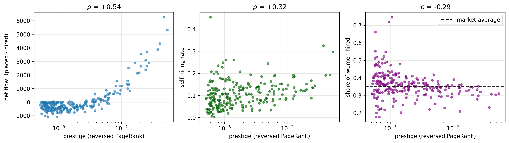

# Abstract {-}

We analyse the network of tenure-track faculty hiring among US universities between 2011 and 2020, in which a directed weighted edge $i \to j$ records how many people earned a PhD at institution $i$ and were later hired as faculty at $j$. We ask whether this labour market is organised as a hierarchy, and whether that can be established using the network alone, without any external university ranking. The answer depends on where one looks. In its topology the market is not hierarchical: 363 of its 368 institutions belong to a single strongly connected component, the density is 0.273, and random null models reproduce most of the structure. The hierarchy is instead in the direction and the volume of the flow. Reversing the edges and running PageRank gives a prestige score that recovers Harvard, Berkeley, Stanford and MIT without any external input, and 78% of the 212,266 hires between distinct institutions descend that ranking. Net flow correlates with prestige at $\rho = 0.537$. Reciprocity, at 0.530 against 0.281 for a random graph of the same density, is the quantity that departs most from randomness. Two expected properties do not hold: a Kolmogorov-Smirnov test rejects the power law wherever the tail is long enough to test it, and the apparent near-acyclicity of the raw data comes from how the faculty rosters were collected rather than from academia.

# Introduction
Every professor was once a PhD student somewhere. If we record where each of them trained and where each of them now works, we obtain a directed network over universities, and the structure of that network reflects the structure of an academic labour market.

This paper asks whether that market is organised as a hierarchy. By hierarchy we mean that academics move systematically in one direction along a ranking of institutions. We also ask a second question, which constrains how we answer the first. Can this be established using the network alone, without importing an external ranking such as US News or the Shanghai list? 

The question is not new. Clauset, Arbesman and Larremore [[2]](#ref2) studied faculty placement in computer science, business and history, and found it to be very unequal. They showed that a prestige hierarchy can be inferred from hiring data alone. Wapman, Zhang, Clauset and Larremore [[1]](#ref1) later extended this to all of US academia, assembling the faculty rosters of 368 PhD-granting institutions across 111 fields. That dataset is the one we analyse here.

Their approach fits SpringRank, a model designed to recover linear hierarchies. We do not use it, for two reasons. It is not part of this course, and a method designed to find hierarchies makes finding one less informative. We ask instead whether the standard descriptive tools introduced in the course are enough to detect and measure the same phenomenon: connected components, degree distributions, centrality, clustering, communities, assortativity and random null models.

We test four hypotheses, drawn from the literature and from the course.

1. **H1.** The network is hierarchical: faculty move predominantly in one direction between institutions of different standing.
2. **H2.** The degree distributions are heavy-tailed, and possibly scale-free, as is common in networks where large actors attract disproportionate attention.
3. **H3.** The network is disassortative by degree, like most non-social networks.
4. **H4.** The market is divided into communities, whether by geography, by institutional type, or by prestige.

Our results support H1 in a more specific form than expected, support H3, reject H2 under a formal statistical test, and support H4 only weakly. The analysis also produces a methodological finding. The raw data seems at first to show an extreme hierarchy. That impression comes from the way the dataset was collected, rather than from academia. Once this is taken into account, the conclusion becomes the opposite one.
 
# Materials and Methods

## Data

The dataset is *US faculty hiring networks*, published with Wapman et al. [[1]](#ref1) and obtained from the
Netzschleuder catalogue [[7]](#ref7). We use the aggregate version, `faculty_hiring_us`, network `academia`,
which combines all fields.

A node is a university. A directed edge $i \to j$ with weight $w_{ij}$ records that $w_{ij}$ people
earned a PhD at $i$ and held a tenure-track position at $j$ at some point between 2011 and 2020.
Each edge also carries the same count split by gender, in the columns `men` and `women`. Each node
carries two attributes, `non_attrition` and `attrition`, which count the faculty who stayed and the
faculty who left during the same period.

The raw file contains 3,284 nodes and 61,936 directed edges, representing 274,474 individual hires,
of which 152,042 are men and 81,846 are women.

## Preprocessing and the two-population structure

Three preprocessing decisions affect everything that follows.

**Header cleaning.** The column headers in the CSV files are written as a comment line, with a `#`
prefix and additional spaces. They must be stripped before any column can be addressed by name.

**Self-loops.** 358 edges are self-loops, that is, universities hiring their own PhD graduates. They
account for 26,720 hires, or 9.7% of the total. This is too large a share to treat as noise, but a
self-loop is not a movement between institutions, and it adds to both the incoming and the
outgoing totals of a university people who never moved. We remove self-loops from the graphs but keep their counts separately, because self-hiring is a finding we analyse later rather than noise to discard.

**Two populations of node.** Only 368 of the 3,284 nodes ever appear as the target of an edge. The reason is the method: Wapman et al. took the list of professors at 368 US universities and recorded where each of them had earned a PhD. The target is therefore always one of those 368, while the source can be any university in the world. A foreign university appears as a source but never as a hirer, and that absence says nothing about its hiring. The largest such sources are Toronto, Cambridge, Oxford and ETH Zurich. The node attributes confirm this reading: `non_attrition` and `attrition` are recorded for exactly those 368 nodes and are zero everywhere else.

## Methods and implementation

All graph algorithms use `igraph` 1.0.0 [[6]](#ref6), the library used throughout the course, called from
Python 3.11 with `pandas`, `numpy`, `scipy`, `matplotlib` and `seaborn`. Louvain and the two random
generators draw random numbers, so the analysis runs under a fixed seed and the reported figures are
reproducible.

Clustering, community detection and eigenvector centrality are defined on undirected graphs, so for
these we ignore the direction of the edges and add together the weights of any pair that points both
ways.

The network is small enough that no approximation was needed. At 368 nodes and 36,870 edges, every
quantity reported here is computed exactly in a few seconds, including betweenness and average path
length.

Two parts were written by the author rather than taken from a library. The first is the power-law
test, which follows Clauset, Shalizi and Newman [[3]](#ref3). The second is the analysis of net flow, self-hiring
and gender, together with the prestige-ladder figure.

The power-law code was validated against the reference `powerlaw` package [[8]](#ref8). The comparison revealed a
defect in the way an earlier version of our code measured the distance between the data and the
fitted curve. After correcting it, our exponents agree with the package to four decimal places. The
two implementations still choose different starting points for the in-strength tail, which is why we report that case as inconclusive.

# Results and Discussion

## Taxonomy and basic properties

The density of a network is the number of connections that exist, divided by the number that could
exist. In the market network it is 0.273. This means that more than a quarter of all possible
ordered pairs of these 368 universities exchanged at least one faculty member during the decade,
and that the average university did so with about 100 of the other 367.
In a network where almost every pair is connected, knowing which pairs are connected tells us
little, so any structure is more likely to lie in the weights and the directions instead.

Two further measures describe how far apart universities are. The average path length is the
average number of steps needed to get from one university to another by the shortest route, and the
diameter is the longest of those shortest routes. Here they are 1.82 and 6, so almost every pair of
universities is one or two steps apart. This follows from the density rather than telling
us something new: when a quarter of all possible connections already exist, short distances are
almost unavoidable. We report the numbers for completeness and do not treat them as evidence of a
small-world effect.

## Connected components, and an artefact that looks like a discovery

We split the supply network into strongly connected components. A strongly connected component is a
group of universities in which, starting from any one of them, you can reach all the others by
following the direction of the edges.

There are 2,922 of them, and 2,921 contain a single university. A component of one means that the
university cannot get back to itself, because no chain of edges leads out of it and returns.

This looks like a strict hierarchy, in which faculty move in one direction only. That interpretation is wrong. Those single nodes are the universities whose faculty lists
were never collected, so they can only have outgoing edges. The result therefore seems to measure
how the data was gathered rather than how academia works.

{width=88%}

In the market network, where we see both ends of every edge, 363 of the 368 universities fall into
one component. In terms of topology, this market is not a hierarchy.

## Degree distributions and the power law that isn't

We measure four quantities: in-degree, out-degree, in-strength and out-strength. The ratio between
the maximum and the mean tells us how unequal each one is. It is 2.1 for in-degree, 3.0 for
out-degree, 4.1 for in-strength, and 13.2 for out-strength. The sending side is therefore
considerably more unequal than the receiving side. The number of
people a university can hire is limited by the number of posts it has, which depends on its size.
The number it can place is not limited in the same way, because nothing stops one university from
placing five times as many graduates as the next. Being bounded on the way in and unbounded on the way out
is consistent with a system in which a few institutions supply many of the others.

{width=75%}

A power law says that the fraction of universities above $k$ falls by the same factor every time
$k$ doubles. We test this with the method of Clauset, Shalizi and Newman [[3]](#ref3), which fits the best
possible power law by maximum likelihood and then measures the gap $D$ between the data and that
fit. Fitting the best available law first is what makes a rejection meaningful: if the best line
fails, no line works. For the supply out-degree we find $\alpha = 1.53$ above $k_{min} = 1$, with
$D = 0.040$ against a threshold of $0.024$, so the power law is rejected. For the market
out-strength we find $\alpha = 1.52$ above $k_{min} = 56$, with $D = 0.102$ against $0.089$, again
rejected. The third quantity, in-strength, has only 106 observations in its tail; our implementation
and the reference package choose different values of $k_{min}$ and disagree on the verdict, so we
report it as inconclusive rather than quote either answer. The distributions are heavy-tailed, but
they are not power laws. The two terms are not synonyms.

## Centrality: recovering prestige from behaviour alone

Counting how many people a university places ignores where they went. Placing 300 graduates, all of
them at Harvard, Stanford and MIT, is not the same as placing 7,000 across the country. PageRank
addresses this with a circular definition: a university is prestigious if prestigious universities
hire its graduates. Mechanically it is a random walker who wanders the network forever, following
one outgoing edge at random at each step, and the score of a node is the share of time the walker
spends there. The direction of the edges therefore decides what the score measures. In our graph an
edge $i \to j$ means that $i$ trained somebody whom $j$ hired, so a walker following the arrows
drifts towards the universities that receive the most people, which measures size. We reverse every
edge before running PageRank. Each step then means: pick a professor here at random, and go to the
university where they earned their PhD. The walk follows careers in reverse, and ends up most often at the
universities where the professoriate was trained. No external ranking enters the calculation at any point.

The ranking that PageRank returns is Harvard, Berkeley, Stanford, MIT, Yale, Princeton, Michigan,
Chicago, Columbia and Cornell. Berkeley placed more people than Harvard, 7,615 against 6,724, yet
Harvard scores higher, because PageRank weights each placement by the standing of the institution
that made the hire. The other measures point elsewhere, and largely agree with each other. In-strength ranks
Penn State, Ohio State and Florida first: large public universities that hire many people, which
probably reflects the number of posts they have rather than how sought after they are. Betweenness
ranks Utah, Texas A&M and Michigan State, mid-tier institutions that lie on the paths between the
elite and the periphery. Harmonic centrality computed in-mode correlates with in-degree at
$\rho = 0.999$. At an average path length of 1.82 almost every university
is one step away, so a measure based on distance largely reduces to a measure based on counting.

{width=55%}

## Transitivity, communities and assortativity

Global clustering in the market network is 0.683 and average local clustering is 0.755. The difference reflects how the two measures weight universities: the global figure pools every triple in the graph, so high-degree universities dominate it, while the local average counts every university equally, whatever its size. Neither number is easy to interpret on its own at this density, and we return to both in the comparison with null models.

Louvain [[4]](#ref4) finds five communities with modularity $Q = 0.150$, and walktrap [[5]](#ref5) finds nine with $Q = 0.130$. Values below 0.3 are usually taken as weak evidence of community structure, which suggests that this market is not divided into separate sub-markets. One likely reason is the density: at 0.27 there may simply not be enough absent edges for a community boundary to form.

The five communities are nevertheless interpretable, and four of them are broadly regional. The largest holds 128 institutions and is led by Harvard, Michigan, MIT, Cornell, Chicago and Yale; a second holds 105 and is southern, led by UT Austin, Texas A&M, Florida and Georgia; a third holds 68 and covers the Midwest, led by Wisconsin, Illinois, Minnesota and Ohio State; a fourth holds 62 and is western, led by Berkeley, Stanford, UCLA and Washington. The fifth contains only five institutions, all Baptist theological seminaries, and it is the most closed group in the network: 83% of the people it trains stay within it. Geography and prestige are therefore not the only organising principles; denomination produces a small community of its own.

Across the whole market, 41.0% of hiring flow stays inside a community. The baseline for comparison is not $1/5$: that would assume the five communities were the same size, and they range from 128 institutions down to five. Weighting each community by its share of outgoing and incoming people gives an expected 25.5%. The preference for hiring within one's own community is thus real but moderate.

{width=78%}

Degree assortativity is $-0.141$ on the directed graph and $-0.197$ on the undirected projection, so
well-connected universities tend to attach to poorly-connected ones. The sign can be anticipated
from arithmetic. There are a handful of large universities and hundreds of small ones, so a
university that places graduates almost everywhere must send most of them to small institutions. The
dataset also provides a scalar node attribute, `non_attrition`, which counts the faculty who stayed
and serves as a proxy for the size of a department. Assortativity by that attribute is $-0.091$,
which is much weaker, so universities of similar size are only slightly more likely to exchange
faculty.

## Null models: what is genuinely non-random

The numbers reported so far are hard to judge on their own, because we do not know what randomness alone would produce. A null model answers this. It is a random graph that keeps some features of the real network and scrambles the rest, and what it keeps decides the question being asked.
We use two. The Erdos-Renyi model keeps only the number of nodes and edges, so it asks how much of a result comes from the density. The configuration model keeps the exact in- and out-degree of every node, so it asks how much comes from the degree sequence. The second is the stricter test, because it already accepts that some universities are much larger than others.

| quantity | empirical | Erdos-Renyi | configuration |
|:--|--:|--:|--:|
| reciprocity | 0.530 | 0.281 | 0.333 |
| largest strongly connected component | 363 | 368 | 363 |
| global clustering $C$ | 0.683 | 0.470 | 0.548 |
| degree assortativity | -0.141 | -0.010 | -0.045 |
| modularity $Q$ (unweighted) | 0.065 | 0.043 | 0.046 |

Both null models reproduce the largest strongly connected component. This suggests that the result reported above comes from the density rather than from anything specific to academic hiring.

Clustering is mostly explained. A random graph of the same size reaches 0.470 of the observed 0.683, and a smaller excess remains.

Assortativity behaves differently. The configuration model reaches only -0.045, while we observe $-0.141$. The arithmetic argument given above may therefore explain about a third of the effect, and the rest seems to need another explanation.

The community structure is weak in absolute terms, but it is not nothing. Modularity on the unweighted projection is 0.065 against 0.043 and 0.046 for the two null models, so roughly a third of it is more than randomness alone would produce. That is a small effect, and it is consistent with the regional preference reported above.

Reciprocity differs from both models more than any other quantity we measured. We observe 0.530 against 0.281 and 0.333. Faculty exchange between two universities is mutual much more often than either model produces.
One interpretation is that departments build lasting relationships rather than filling each post independently, although our data cannot test this directly.

## Where the hierarchy lives

The previous sections establish what the hierarchy is not. The topology is dense, almost entirely
mutually connected, and largely reproduced by random models. If a hierarchy exists, it is more
likely to be found in the weights.

Net flow is the number of people an institution produced minus the number it hired.
Berkeley produced 7,615 and hired 1,359, a net flow of $+6{,}256$. Harvard produced 6,724 and hired
1,409. At the other end, George Mason produced 235 and hired 1,331, and East Carolina produced 56
and hired 1,084. Across the 233 institutions with at least 50 hires and 50 placements, net flow
correlates with prestige at $\rho = 0.537$.

That correlation is clear but not very strong. Net flow is a raw
count, so it depends on the size of the institution as well as on its position. A small but highly prestigious university cannot
have a large net flow, because it does not train many people.

We therefore ask a question that does not depend on size, and that can be put to every edge in the
network: does this hire move down the prestige ranking, or up? Of the 212,266 hires between distinct
institutions, 166,076 move down and 46,190 move up. That is 78.2% against 21.8%. A market with no
hierarchy would give roughly half and half.

{width=68%}

The result does not depend on how large the institutions are. The prestige score behind it is
itself a topological measure, but it was derived from the network rather than from any external
ranking. In plain terms, a person finishing a PhD is
far more likely to be hired by a less prestigious university than by a more prestigious one.

The self-loops set aside during preprocessing can now be examined. Self-hiring accounts for 11.2%
of hires inside the market network, or 9.7% of every hire in the dataset, and it is not spread
evenly: the rate correlates with prestige at $\rho = 0.323$. MIT retains 33% of
its hires from its own graduates and Harvard 30%. This is consistent with the downhill pattern,
since a graduate of a top institution has no more prestigious institution to move to, so staying
may be the only option that does not involve moving down.

Finally, because every edge carries its count split by gender, we can compute the share of women
among the faculty each university hired. Across the market it is 34.8%, and the correlation with
prestige is negative, $\rho = -0.286$. This result should not be interpreted too widely. The network aggregates all
107 academic fields, and fields differ both in their gender composition and in which institutions
dominate them. If elite institutions are concentrated in male-dominated fields, this correlation
would appear even if every field hired women at an identical rate everywhere. That is Simpson's
paradox. Our data cannot separate the two explanations, so we report the association and do not
claim a cause.

{width=78%}

# Conclusions

**H1, hierarchy: supported, in a more specific form than expected.** The market is hierarchical, but not in its topology, which is dense, mutual and largely reproduced by random models. The hierarchy is in the direction and the volume of the flow: 78% of hires between distinct institutions descend the prestige ranking. Prestige itself can be obtained from the network alone, by reversing the edges and running PageRank.

**H2, scale-free: rejected where it can be tested.** Both distributions with a tail long enough to test fail a Kolmogorov-Smirnov test against the best possible power-law fit. The third has too short a tail for the test to decide, and we report it as inconclusive rather than choose a verdict.

**H3, disassortativity: supported**, at $-0.141$ against $-0.045$ for the configuration model, so the degree sequence accounts for about a third of it and the remainder does not.

**H4, communities: weakly supported.** Modularity is $0.150$ over five communities, four of them broadly regional and one a closed group of five theological seminaries. 41% of hiring flow stays inside a community, against 25.5% expected once the unequal community sizes are taken into account.

Reciprocity differs most from what randomness produces, at 0.530 against 0.281. And the raw data seems at first to show an extreme hierarchy, an impression that comes from how the dataset was collected rather than from academia; taking this into account turns the conclusion into its opposite.

The study has clear limits. It covers only US tenure-track faculty at PhD-granting institutions, only the decade from 2011 to 2020, and the decade is aggregated, so we cannot say how the hierarchy changed over time. The 2,916 institutions outside the observed rosters are seen from one side only and cannot be analysed structurally. The `attrition` attribute does not distinguish retirement from leaving academia. The gender result is confounded by field composition, as discussed above.

The same source publishes the network separately for each of 107 academic fields. Repeating this analysis field by field would test directly whether the gender association survives within fields, and whether the hierarchy is steeper in some disciplines than in others.
Every method used here would transfer unchanged.

# Acknowledgements {-}

This project was carried out with the assistance of an AI tutor, which wrote the analysis code,
produced draft text that I revised, and corrected my English. The interpretation of the results and
the decisions about what to report are my own.

# References

1. []{#ref1}Wapman, K. H., Zhang, S., Clauset, A., Larremore, D. B. Quantifying hierarchy and dynamics in US
   faculty hiring and retention. *Nature* **610**, 120–127 (2022).
   <https://doi.org/10.1038/s41586-022-05222-x>
2. []{#ref2}Clauset, A., Arbesman, S., Larremore, D. B. Systematic inequality and hierarchy in faculty hiring
   networks. *Science Advances* **1**(1), e1400005 (2015).
3. []{#ref3}Clauset, A., Shalizi, C. R., Newman, M. E. J. Power-law distributions in empirical data.
   *SIAM Review* **51**(4), 661–703 (2009).
4. []{#ref4}Blondel, V. D., Guillaume, J.-L., Lambiotte, R., Lefebvre, E. Fast unfolding of communities in
   large networks. *Journal of Statistical Mechanics: Theory and Experiment*, P10008 (2008).
5. []{#ref5}Pons, P., Latapy, M. Computing communities in large networks using random walks.
   *Journal of Graph Algorithms and Applications* **10**(2), 191–218 (2006).
6. []{#ref6}Csardi, G., Nepusz, T. The igraph software package for complex network research.
   *InterJournal, Complex Systems* **1695** (2006).
7. []{#ref7}Peixoto, T. P. The Netzschleuder network catalogue and repository.
   <https://networks.skewed.de/net/faculty_hiring_us>
8. []{#ref8}Alstott, J., Bullmore, E., Plenz, D. powerlaw: a Python package for analysis of heavy-tailed
   distributions. *PLoS ONE* **9**(1), e85777 (2014).
   <https://doi.org/10.1371/journal.pone.0085777>
